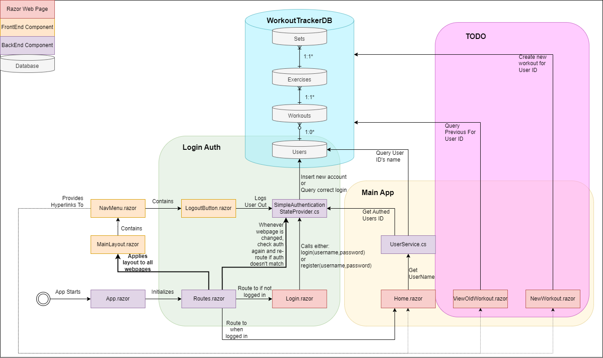

# WorkoutWebApp

## Technical Documentation

### Code Documentation

- Navigate to `.\WorkoutTracker\docs`
- Launch PowerShell Window
- Optional run `docfx docfx.json`
    - (only necessary if you have made changes to the docstrings and/or files)
- Run `docfx serve _site`
- Open `http://localhost:8080` in your browser

### Simple Class Diagram

### User Story

#### Previous Workouts

- As a user, I want to be able to see a list of my previous workouts so that I can track my progress.
- As a user, I want to be able to see diagrams based on my previous workouts as it helps me to better understand my progress.
- As a user, I want to be able to see the exercises I did in my previous workouts, so I can plan my next workout.

#### New Workouts

- As a user, I want to be able to add new workouts, so that I can track my progress.
- As a user, when I add a new workout, I want it to suggest exercises based on my previous workouts of the same type, so I can save time.
- As a user, when I add an exercise, I want to see the reps, sets, and weight I used in the past for that exercise; so I can improve my performance.

### User Flow

#### Previous Workouts

1. User logs in
2. User is on the main page
3. User sees a list of previous workouts
4. User clicks on a workout
5. User sees a list of exercises in the workout
6. User taps on an exercise to see the historic details
7. User sees a diagram of the historic details (eg weight changes over time)
8. User either:
   1. Presses back button to go back to the main page
   2. Presses delete button if they want to delete the workout

#### New Workouts

1. User logs in
2. User is on the main page
3. User clicks on the add workout button
4. User sees an empty Table with a button to add exercises
5. User clicks on the add exercise button
6. User types in the exercise name, with autofill suggestions based on previous workouts
7. If we have previous data for this exercise, we autofill the reps, sets, and weight
8. User modifies these values if they want
9. User clicks on the Confirm button
10. Repeat steps 5-9 until the user is done
11. User either 
    1.  Clicks on the Save button if they want to save the workout
    2.  Clicks on the Cancel button if they want to discard the workout
12. User is taken back to the main page